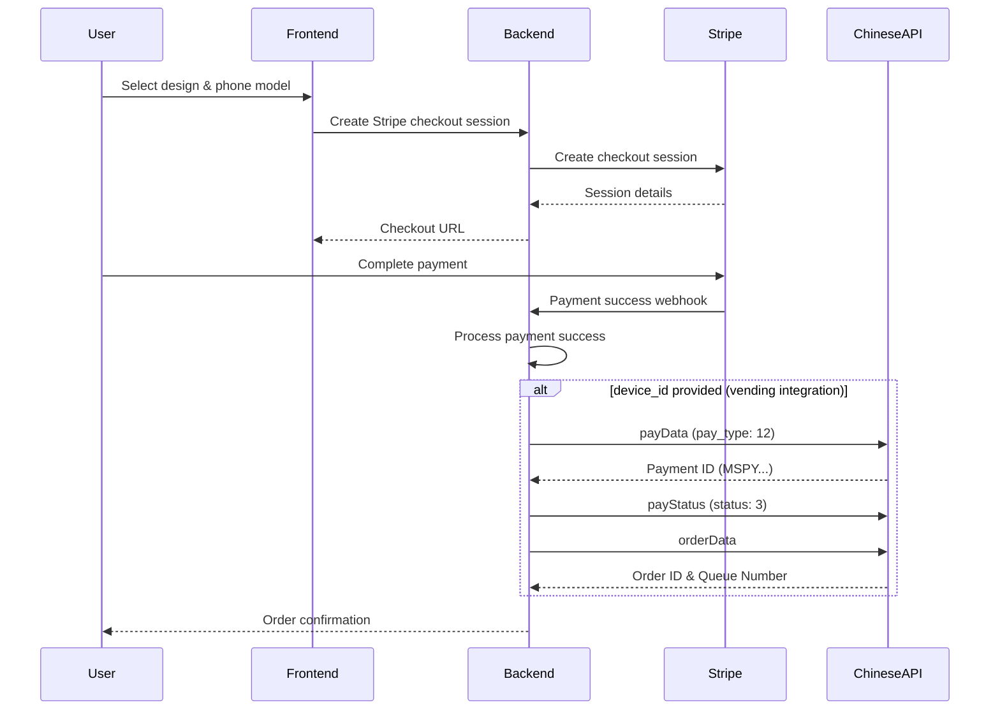
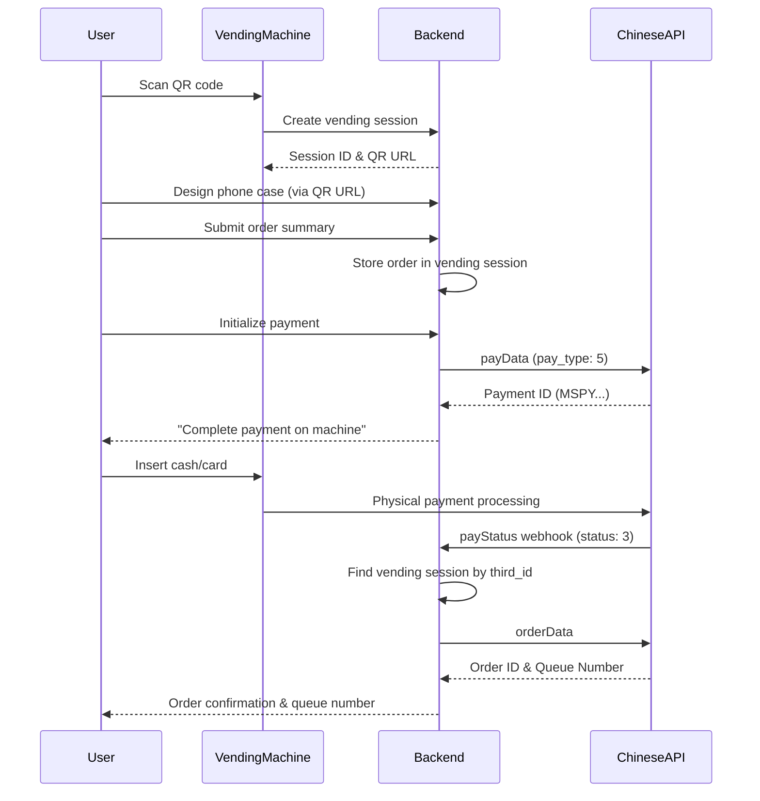

# Chinese API Integration Guide

**Document Version**: 2.0  
**Last Updated**: 2025-08-30  
**Target Audience**: Chinese Manufacturing Partner Development Team  

## Overview

This document provides comprehensive integration guidance for two distinct payment flows in our phone case printing system:

1. **"Pay via App"** - Online payments through Stripe with optional Chinese API integration
2. **"Pay via Machine"** - Physical vending machine payments with mandatory Chinese API integration

## Table of Contents

- [Payment Flow Comparison](#payment-flow-comparison)
- [Pay via App Flow](#pay-via-app-flow)
- [Pay via Machine Flow](#pay-via-machine-flow)
- [Chinese API Endpoints](#chinese-api-endpoints)
- [Webhook Integration](#webhook-integration)
- [Error Handling](#error-handling)
- [Testing & Debugging](#testing--debugging)
- [Troubleshooting](#troubleshooting)

## Payment Flow Comparison

| Aspect | Pay via App | Pay via Machine |
|--------|-------------|-----------------|
| **Payment Method** | Stripe (Credit Card) | Physical Machine (Cash/Card) |
| **pay_type** | `12` | `5` |
| **Chinese API Required** | Optional (only if device_id provided) | Mandatory |
| **Session Management** | Stripe sessions | VendingMachineSession |
| **Payment Confirmation** | Stripe webhook | Chinese API webhook |
| **Order Processing** | Immediate after Stripe success | After Chinese webhook |

## Pay via App Flow

### Flow Overview


### Key Characteristics

1. **Payment Processing**: Handled by Stripe
2. **Chinese API Integration**: Optional - only triggered if `device_id` is provided
3. **pay_type**: Always `12` for app payments
4. **Immediate Processing**: Order is processed immediately after Stripe confirms payment

### App Payment API Calls

#### 1. Create Stripe Checkout Session
```http
POST /create-checkout-session
Content-Type: application/json

{
  "brand_name": "iphone",
  "model_name": "iPhone 15 Pro",
  "color": "Natural Titanium",
  "template_id": "classic",
  "design_image_url": "https://example.com/design.png",
  "device_id": "OPTIONAL_DEVICE_ID",  // If provided, triggers Chinese API
  "price": 19.99
}
```

#### 2. Process Payment Success
```http
POST /process-payment-success
Content-Type: application/json

{
  "session_id": "cs_stripe_session_id",
  "order_data": {
    "brand": "iphone",
    "model": "iPhone 15 Pro",
    "chinese_model_id": "MM020250224000010",
    "mobile_shell_id": "MS102503270003",
    "device_id": "OPTIONAL_DEVICE_ID",
    "finalImageUrl": "https://example.com/final-design.png"
  }
}
```

### Chinese API Integration for App Payments

If `device_id` is provided, the following Chinese API calls are made:

#### 1. payData Call
```json
{
  "mobile_model_id": "MM020250224000010",
  "device_id": "DEVICE_ID",
  "third_id": "PYEN250830123456",
  "pay_amount": 19.99,
  "pay_type": 12
}
```

#### 2. payStatus Call (Notification)
```json
{
  "third_id": "PYEN250830123456",
  "status": 3,
  "pay_amount": 19.99
}
```

#### 3. orderData Call
```json
{
  "third_pay_id": "MSPY10250830000001",
  "third_id": "OREN250830123456",
  "mobile_model_id": "MM020250224000010",
  "mobile_shell_id": "MS102503270003",
  "pic": "https://example.com/final-design.png",
  "device_id": "DEVICE_ID"
}
```

## Pay via Machine Flow

### Flow Overview


### Key Characteristics

1. **Session-Based**: Uses VendingMachineSession to track state
2. **Two-Phase Payment**: 
   - Phase 1: Reserve printing slot (`payData`)
   - Phase 2: Confirm physical payment (`payStatus` webhook)
3. **pay_type**: Always `5` for vending machine payments
4. **Webhook Processing**: Order is processed only after webhook confirms payment

### Vending Machine API Calls

#### 1. Create Vending Session
```http
POST /api/vending/create-session
Content-Type: application/json

{
  "machine_id": "CXYLOGD8OQUK",
  "location": "Shopping Mall A",
  "session_timeout_minutes": 30
}
```

**Response:**
```json
{
  "success": true,
  "session_id": "CXYLOGD8OQUK_20250830_075329_A2440143",
  "qr_url": "https://pimpmycase.shop/?qr=true&machine_id=CXYLOGD8OQUK&session_id=CXYLOGD8OQUK_20250830_075329_A2440143",
  "expires_at": "2025-08-30T08:25:29Z"
}
```

#### 2. Register User with Session
```http
POST /api/vending/session/{session_id}/register-user
Content-Type: application/json

{
  "machine_id": "CXYLOGD8OQUK",
  "session_id": "CXYLOGD8OQUK_20250830_075329_A2440143"
}
```

#### 3. Submit Order Summary
```http
POST /api/vending/session/{session_id}/order-summary
Content-Type: application/json

{
  "designImage": "data:image/png;base64,...",
  "price": 19.99,
  "brand": "iphone",
  "brand_id": "BR20250111000002",
  "model": "iPhone 15 Pro",
  "chinese_model_id": "MM020250224000010",
  "mobile_shell_id": "MS102503270003",
  "device_id": "CXYLOGD8OQUK",
  "template": "classic",
  "finalImagePublicUrl": "https://example.com/final-design.png"
}
```

#### 4. Initialize Payment
```http
POST /api/vending/session/{session_id}/init-payment
```

**Response:**
```json
{
  "success": true,
  "message": "Vending machine payment initialized - complete payment on machine",
  "session_id": "CXYLOGD8OQUK_20250830_075329_A2440143",
  "third_id": "PYEN250830540573",
  "payment_amount": 19.99,
  "chinese_payment_id": "MSPY10250830000008",
  "status": "awaiting_payment",
  "instructions": "Complete payment on vending machine to receive order confirmation"
}
```

#### 5. Check Session Status
```http
GET /api/vending/session/{session_id}/status
```

**Response (Before Payment):**
```json
{
  "session_id": "CXYLOGD8OQUK_20250830_075329_A2440143",
  "status": "payment_pending",
  "user_progress": "payment_pending",
  "payment_amount": 19.99,
  "instructions": "Complete payment on vending machine",
  "chinese_payment_id": "MSPY10250830000008"
}
```

**Response (After Payment):**
```json
{
  "session_id": "CXYLOGD8OQUK_20250830_075329_A2440143",
  "status": "payment_completed",
  "user_progress": "order_submitted",
  "payment_amount": 19.99,
  "queue_number": "001",
  "order_status": "printing",
  "chinese_order_id": "ORDER123456789"
}
```

## Chinese API Endpoints

### Authentication
```http
POST http://app-dev.deligp.com:8500/mobileShell/en/user/login
Content-Type: application/json
sign: {MD5_SIGNATURE}
req_source: en

{
  "account": "your_account",
  "password": "your_password"
}
```

### Core Integration Endpoints

#### 1. Get Stock List
```http
POST http://app-dev.deligp.com:8500/mobileShell/en/stock/list
Content-Type: application/json
Authorization: {JWT_TOKEN}
sign: {MD5_SIGNATURE}
req_source: en

{
  "device_id": "CXYLOGD8OQUK",
  "brand_id": "BR20250111000002"
}
```

#### 2. Send Payment Data
```http
POST http://app-dev.deligp.com:8500/mobileShell/en/order/payData
Content-Type: application/json
Authorization: {JWT_TOKEN}
sign: {MD5_SIGNATURE}
req_source: en

{
  "mobile_model_id": "MM020250224000010",
  "device_id": "CXYLOGD8OQUK",
  "third_id": "PYEN250830540573",
  "pay_amount": 19.99,
  "pay_type": 5  // 5 for vending, 12 for app
}
```

#### 3. Send Order Data
```http
POST http://app-dev.deligp.com:8500/mobileShell/en/order/orderData
Content-Type: application/json
Authorization: {JWT_TOKEN}
sign: {MD5_SIGNATURE}
req_source: en

{
  "third_pay_id": "MSPY10250830000008",  // Chinese payment ID from payData response
  "third_id": "OREN250830540573",        // Order ID (different from payment third_id)
  "mobile_model_id": "MM020250224000010",
  "mobile_shell_id": "MS102503270003",
  "pic": "https://pimpmycase.onrender.com/image/design.png",
  "device_id": "CXYLOGD8OQUK"
}
```

## Webhook Integration

### Payment Status Webhook (payStatus)

**Endpoint**: `https://pimpmycase.onrender.com/api/chinese/order/payStatus`  
**Method**: `POST`  
**Authentication**: Not required (webhook from Chinese system)

#### Request Format
```json
{
  "third_id": "PYEN250830540573",
  "status": 3  // 1=pending, 2=processing, 3=paid, 4=failed, 5=abnormal
}
```

#### Response Format
```json
{
  "msg": "操作成功",
  "code": 200
}
```

#### Webhook Processing Logic

1. **Receive webhook** with `third_id` and payment status
2. **Find vending session** using SessionDataManager by searching for `payment_data.third_id`
3. **Extract order data** from vending session (design image, phone model, etc.)
4. **Generate order third_id** (OREN format) for orderData call
5. **Call orderData** with order details
6. **Update session status** and store queue number
7. **Return success response** to Chinese API

#### Critical Session Data Structure

For successful webhook processing, vending sessions must contain:

```json
{
  "payment_data": {
    "third_id": "PYEN250830540573",      // Used by webhook to find session
    "amount": 19.99,
    "mobile_model_id": "MM020250224000010",
    "device_id": "CXYLOGD8OQUK",
    "pay_type": 5,
    "mobile_shell_id": "MS102503270003"
  },
  "order_summary": {
    "chinese_model_id": "MM020250224000010",
    "mobile_shell_id": "MS102503270003",
    "device_id": "CXYLOGD8OQUK",
    "finalImagePublicUrl": "https://example.com/design.png",
    "brand_id": "BR20250111000002"
  },
  "chinese_payment_id": "MSPY10250830000008",
  "final_image_url": "https://example.com/design.png"
}
```

## Error Handling

### Common Error Scenarios

#### 1. Session Not Found in Webhook
**Problem**: Chinese API sends payStatus webhook but no vending session found

**Causes**:
- Session data not properly stored during init-payment
- third_id mismatch between payData and webhook
- Session expired or cleaned up

**Resolution**:
- Check SessionDataManager logs for persistence verification
- Verify third_id generation consistency
- Implement fallback order creation from PaymentMapping table

#### 2. Missing Order Data in Session
**Problem**: Session found but lacks required order data for orderData call

**Causes**:
- order-summary endpoint not called before init-payment
- Session data corruption or incomplete storage

**Resolution**:
- Enforce order-summary submission before payment initialization
- Add comprehensive validation in init-payment endpoint

#### 3. Chinese API Authentication Failures
**Problem**: payData or orderData calls fail with 401/403 errors

**Causes**:
- Invalid authentication credentials
- Expired JWT token
- Incorrect signature generation

**Resolution**:
- Verify account credentials in environment variables
- Check signature generation algorithm
- Implement automatic token refresh

### Error Response Handling

#### Chinese API Error Responses
```json
{
  "msg": "参数错误",
  "code": 400,
  "data": null
}
```

#### Our API Error Responses
```json
{
  "detail": "Session not found",
  "status_code": 404
}
```

## Testing & Debugging

### Test Environment Setup

1. **Chinese API Base URL**: `http://app-dev.deligp.com:8500/mobileShell/en`
2. **Test Device IDs**: `CXYLOGD8OQUK`, `VM_TEST_MANUFACTURER`
3. **Test Credentials**: Provided separately for security

### Debug Endpoints

#### 1. Test Connection
```http
GET https://pimpmycase.onrender.com/api/chinese/test-connection
```

#### 2. Session Validation
```http
GET https://pimpmycase.onrender.com/api/chinese/debug/session-validation/{session_id}
```

### Logging & Monitoring

#### Key Log Patterns

**Successful Payment Initialization**:
```
✅ CRITICAL SUCCESS: Payment data stored using SessionDataManager!
- third_id: PYEN250830540573
- Payment data persistence: ✅ VERIFIED
```

**Successful Webhook Processing**:
```
✅ FOUND MATCHING VENDING SESSION: CXYLOGD8OQUK_20250830_075329_A2440143
✅ Order successfully sent to Chinese API - Session payment completed
✅ Queue number: 001
```

**Error Indicators**:
```
❌ CRITICAL: SessionDataManager failed to store payment data!
❌ No vending session found for third_id: PYEN250830540573
❌ Missing required order data fields in session
```

### Test Scenarios

#### 1. End-to-End Vending Machine Payment
1. Create vending session
2. Register user with session
3. Submit order summary
4. Initialize payment (triggers payData)
5. Simulate Chinese webhook (payStatus)
6. Verify orderData call and queue number

#### 2. App Payment with Device Integration
1. Create Stripe checkout session with device_id
2. Complete payment on Stripe
3. Process payment success (triggers Chinese API calls)
4. Verify order creation with queue number

## Troubleshooting

### Issue: Webhook Not Finding Sessions

**Symptoms**:
- Chinese API sends payStatus webhook
- Log shows "No vending session found for third_id"
- Orders created from PaymentMapping fallback

**Debug Steps**:
1. Check SessionDataManager persistence verification logs
2. Verify third_id matches between payData and webhook
3. Inspect database session_data JSON field directly
4. Check for concurrent session modifications

**Solution**:
- Ensure flag_modified is called for all session_data updates
- Use SessionDataManager for all session_data operations
- Add database-level verification queries

### Issue: Duplicate Chinese API Calls

**Symptoms**:
- Multiple payData calls for same payment
- Chinese API returns duplicate third_id errors

**Debug Steps**:
1. Check for multiple init-payment calls
2. Verify payment data not stored from frontend
3. Review retry logic in payment processing

**Solution**:
- Implement payment state tracking
- Add duplicate call detection
- Use stored payment IDs to avoid redundant calls

### Issue: Order Data Missing in Webhook

**Symptoms**:
- Session found by third_id
- orderData call fails due to missing parameters

**Debug Steps**:
1. Verify order-summary was called before init-payment
2. Check session_data structure and required fields
3. Validate mobile_shell_id presence

**Solution**:
- Enforce order-summary submission workflow
- Add comprehensive validation in init-payment
- Implement order data recovery mechanisms

## Contact & Support

For integration support and questions:

- **Technical Issues**: Check logs and error patterns described above
- **API Questions**: Refer to endpoint specifications in this document
- **Webhook Problems**: Use SessionDataManager debug logs for troubleshooting

## Appendix

### Third ID Formats
- **Payment third_id**: `PYEN` + YYMMDD + 6 digits (e.g., `PYEN250830540573`)
- **Order third_id**: `OREN` + YYMMDD + 6 digits (e.g., `OREN250830540573`)
- **Chinese payment_id**: `MSPY` + sequence (e.g., `MSPY10250830000008`)

### Status Codes
- **Payment Status**: 1=pending, 2=processing, 3=paid, 4=failed, 5=abnormal
- **Order Status**: 8=waiting for printing, 9=picking up, 10=pickup completed, 11=printing, 12=printed

### Data Flow Summary
1. **App payments**: Stripe → Chinese API (optional)
2. **Vending payments**: VendingSession → Chinese API (mandatory)
3. **Both flows**: End with orderData call for printing
4. **Key difference**: Vending uses webhook for payment confirmation

---

*This document is maintained by the development team and updated with each integration change.*