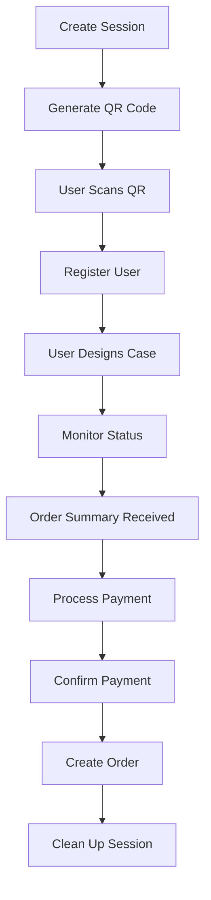

# Chinese Manufacturer API Integration Guide
## PimpMyCase System Integration Documentation

**Version:** 2.2.0  
**Last Updated:** August 2025  
**Base URL:** `https://pimpmycase.onrender.com` (Production)

---

## Overview

This guide provides comprehensive documentation for integrating Chinese manufacturing equipment with the PimpMyCase system. The API enables real-time communication between vending machines, payment systems, and printing equipment.

## Authentication & Security

- **No API Key Required:** All Chinese partner endpoints use relaxed security validation
- **Rate Limiting:** 35 requests per minute per IP address
- **IP Whitelist:** Partner IPs are automatically whitelisted for higher rate limits
- **Session Format:** Flexible session ID formats supported (both standard and Chinese formats)

---

## Core Integration Endpoints

### 1. Connection Testing

#### Test API Connection
```http
GET /api/chinese/test-connection
```

#### Debug Session Validation
```http
GET /api/chinese/debug/session-validation/{session_id}
```

**Parameters:**
- `session_id` (string): Session ID to validate format (e.g., "VM001_20250729_143022_A1B2C3")

**Response:**
```json
{
  "session_id": "VM001_20250729_143022_A1B2C3",
  "validation_result": {
    "is_valid": true,
    "format_details": {
      "machine_id": "VM001",
      "date_part": "20250729", 
      "time_part": "143022",
      "random_part": "A1B2C3"
    },
    "security_level": "relaxed",
    "client_ip": "127.0.0.1"
  }
}
```

**Response:**
```json
{
  "status": "success",
  "message": "Chinese manufacturer API connection successful",
  "api_version": "2.1.0",
  "timestamp": "2025-08-02T14:42:09.492554+00:00",
  "client_ip": "127.0.0.1",
  "security_level": "relaxed_chinese_partner",
  "debug_info": {
    "rate_limit": "35 requests/minute",
    "authentication": "not_required",
    "session_validation": "flexible_format_supported"
  },
  "available_machine_ids": [
    "VM_TEST_MANUFACTURER",
    "10HKNTDOH2BA",
    "CN_DEBUG_01",
    "VM001",
    "VM002"
  ]
}
```

---

## Payment Integration

### 2. Payment Status Management

#### Query Payment Status
```http
GET /api/chinese/payment/{payment_id}/status
```

**Parameters:**
- `payment_id` (string): Unique payment identifier

**Response:**
```json
{
  "payment_id": "TEST_PAYMENT_E90225F45081",
  "status": 3,
  "status_description": "paid",
  "amount": 1999,
  "currency": "GBP",
  "created_at": "2025-08-02T14:35:00Z",
  "updated_at": "2025-08-02T14:37:15Z"
}
```

**Status Codes:**
- `1`: Waiting for payment
- `2`: Payment in progress
- `3`: Payment completed
- `4`: Payment failed
- `5`: Payment abnormal/error

#### Update Payment Status
```http
POST /api/chinese/order/payStatus
```

**Request Body:**
```json
{
  "third_id": "TEST_PAYMENT_E90225F45081",
  "status": 3,
  "message": "Payment confirmed by Chinese system"
}
```

**Validation:**
- `third_id`: Required, non-empty string - Chinese payment system ID
- `status`: Required, integer - Must be 1, 2, 3, 4, or 5
- `message`: Optional, string - Payment status description (max 500 characters)

---

## Equipment Management

### 3. Equipment Information

#### Get Equipment Info
```http
GET /api/chinese/equipment/{equipment_id}/info
```

**Parameters:**
- `equipment_id` (string): Equipment identifier (e.g., "CN_DEBUG_01", "PRINTER_001")

**Response:**
```json
{
  "equipment_id": "CN_DEBUG_01",
  "status": "online",
  "location": "API Testing Environment - Mock Data",
  "capabilities": {
    "max_print_size": "200x300mm",
    "supported_materials": ["TPU", "Silicone", "Hard Plastic"],
    "color_printing": true,
    "estimated_print_time": "15-30 minutes"
  },
  "current_queue": 3,
  "last_maintenance": "2025-08-01T10:00:00Z",
  "note": "This endpoint currently returns mock data for testing purposes"
}
```

#### Update Equipment Stock
```http
POST /api/chinese/equipment/{equipment_id}/stock
```

**Request Body:**
```json
{
  "phone_models": {
    "iphone_14_pro": 45,
    "iphone_15": 32,
    "samsung_s24": 28
  },
  "materials": {
    "clear_tpu": 150,
    "black_silicone": 89,
    "transparent_hard": 67
  },
  "updated_by": "automated_system"
}
```

---

## Phone Model & Stock Management

### 4. Stock Status

#### Get Phone Model Stock Status
```http
GET /api/chinese/models/stock-status
```

**Response:**
```json
{
  "success": true,
  "models": [
    {
      "id": "iphone-iphone-15-pro",
      "name": "iPhone 15 Pro",
      "chinese_model_id": "CN_IPHONE_006",
      "brand_id": "iphone",
      "stock": 45,
      "price": 19.99,
      "is_available": true
    },
    {
      "id": "samsung-galaxy-s24-ultra", 
      "name": "Galaxy S24 Ultra",
      "chinese_model_id": "CN_SAMSUNG_001",
      "brand_id": "samsung",
      "stock": 34,
      "price": 19.99,
      "is_available": true
    },
    {
      "id": "iphone-iphone-14-pro",
      "name": "iPhone 14 Pro", 
      "chinese_model_id": "CN_IPHONE_010",
      "brand_id": "iphone",
      "stock": 32,
      "price": 19.99,
      "is_available": true
    }
  ],
  "summary": {
    "total_models": 25,
    "total_stock": 158,
    "brands_available": ["iphone", "samsung"],
    "last_updated": "2025-08-02T14:30:00Z"
  }
}
```

---

## Order Processing

### 5. Order Management

#### Update Order Status
```http
POST /api/chinese/order-status-update
```

**Request Body:**
```json
{
  "order_id": "ORDER_a819e123",
  "status": "printing",
  "estimated_completion": "2025-08-02T15:30:00Z",
  "notes": "Started printing process",
  "equipment_id": "CN_DEBUG_01"
}
```

**Valid Status Values:**
- `pending`: Order received, queued for processing
- `printing`: Currently being printed
- `printed`: Printing completed
- `completed`: Order fully completed and shipped
- `failed`: Order failed (provide reason in notes)
- `cancelled`: Order cancelled

#### Send Print Command
```http
POST /api/chinese/send-print-command
```

**Request Body:**
```json
{
  "order_id": "ORDER_a819e123",
  "image_urls": [
    "https://cdn.pimpmycase.com/designs/ORDER_a819e123_design1.png",
    "https://cdn.pimpmycase.com/designs/ORDER_a819e123_design2.png"
  ],
  "phone_model": "iphone_15_pro",
  "customer_info": {
    "name": "John Smith",
    "email": "john@example.com",
    "phone": "+44123456789"
  },
  "priority": 2
}
```

**Field Requirements:**
- `order_id`: Required, string - Unique order identifier
- `image_urls`: Required, array of strings - Must be valid HTTPS URLs
- `phone_model`: Required, string - Phone model identifier (e.g., "iphone_15_pro", "samsung_s24")
- `customer_info`: Required, object - Customer contact information
  - `name`: Required, string - Customer name
  - `email`: Required, string - Valid email address
  - `phone`: Required, string - Phone number with country code
- `priority`: Required, integer - Priority level (1-10, where 1=highest priority)

---

## Print Management

### 6. Print Operations

#### Trigger Print Job
```http
POST /api/chinese/print/trigger
```

**Request Body:**
```json
{
  "order_id": "ORDER_a819e123",
  "equipment_id": "CN_DEBUG_01",
  "print_data": {
    "design_url": "https://example.com/design.png",
    "phone_model": "iphone_14_pro",
    "template": "classic",
    "text": "Custom Text",
    "font": "Arial",
    "color": "#000000"
  }
}
```

#### Check Print Status
```http
GET /api/chinese/print/{order_id}/status
```

**Response:**
```json
{
  "order_id": "ORDER_a819e123",
  "print_status": "completed",
  "progress": 100,
  "started_at": "2025-08-02T14:45:00Z",
  "completed_at": "2025-08-02T15:15:00Z",
  "equipment_id": "CN_DEBUG_01",
  "quality_check": "passed"
}
```

---

## File Management

### 7. Download & File Operations

#### Get Order Download Links
```http
GET /api/chinese/order/{order_id}/download-links
```

**Response:**
```json
{
  "order_id": "ORDER_a819e123",
  "download_links": {
    "design_file": "https://cdn.pimpmycase.com/designs/ORDER_a819e123_design.png",
    "print_file": "https://cdn.pimpmycase.com/print/ORDER_a819e123_print.gcode",
    "preview": "https://cdn.pimpmycase.com/preview/ORDER_a819e123_preview.jpg"
  },
  "expiry": "2025-08-09T14:42:00Z"
}
```

#### Batch Download Images
```http
GET /api/chinese/images/batch-download?order_ids=ORDER_1&order_ids=ORDER_2&format=zip
```

**Query Parameters:**
- `order_ids`: Array of order IDs to download
- `format`: `zip` or `tar` (default: zip)

**Response:**
- Content-Type: `application/zip` or `application/x-tar`
- Binary file download containing all requested images

---

## Vending Machine Integration

Chinese manufacturers building vending machines need these endpoints to manage the complete user session lifecycle, from QR code generation to payment processing.

### 8. Session Management

#### Create Vending Machine Session
```http
POST /api/vending/create-session
```

**Request Body:**
```json
{
  "machine_id": "VM001",
  "location": "Oxford Street Mall - Level 2",
  "session_timeout_minutes": 30,
  "metadata": {
    "mall_name": "Oxford Street Mall",
    "floor": "Level 2",
    "timezone": "Europe/London"
  }
}
```

**Response:**
```json
{
  "success": true,
  "session_id": "VM001_20250804_143022_A1B2C3D4",
  "qr_data": {
    "session_id": "VM001_20250804_143022_A1B2C3D4",
    "machine_id": "VM001",
    "expires_at": "2025-08-04T15:00:22Z",
    "qr_url": "https://pimpmycase.shop?session=VM001_20250804_143022_A1B2C3D4&machine=VM001"
  },
  "session_info": {
    "status": "active",
    "user_progress": "started",
    "expires_at": "2025-08-04T15:00:22Z",
    "created_at": "2025-08-04T14:30:22Z"
  }
}
```

#### Get Session Status
```http
GET /api/vending/session/{session_id}/status
```

**Response:**
```json
{
  "session_id": "VM001_20250804_143022_A1B2C3D4",
  "status": "designing",
  "user_progress": "design_complete",
  "expires_at": "2025-08-04T15:00:22Z",
  "created_at": "2025-08-04T14:30:22Z",
  "last_activity": "2025-08-04T14:45:10Z",
  "machine_id": "VM001",
  "security_validated": true,
  "order_id": "ORDER_a819e123",
  "payment_amount": 21.99,
  "session_data": {
    "brand": "iphone",
    "model": "iPhone 15 Pro",
    "template": "retro-remix",
    "user_selections": {
      "images_uploaded": 1,
      "text_added": "My Custom Text",
      "font": "Inter"
    }
  }
}
```

**Session Status Values:**
- `active`: Session created, waiting for user
- `designing`: User is designing their case
- `payment_pending`: Design complete, waiting for payment
- `payment_completed`: Payment processed successfully
- `expired`: Session has expired
- `cancelled`: Session was cancelled

**User Progress Values:**
- `started`: Session created
- `qr_scanned`: User scanned QR code
- `designing`: User is in design phase
- `design_complete`: Design finished, ready for payment
- `payment_reached`: User reached payment screen

#### Register User with Session
```http
POST /api/vending/session/{session_id}/register-user
```

**Request Body:**
```json
{
  "machine_id": "VM001",
  "session_id": "VM001_20250804_143022_A1B2C3D4",
  "location": "Oxford Street Mall - Level 2",
  "user_agent": "Mozilla/5.0 (iPhone; CPU iPhone OS 17_0 like Mac OS X)",
  "ip_address": "192.168.1.100"
}
```

**Response:**
```json
{
  "success": true,
  "message": "User registered with vending machine session",
  "session_status": {
    "status": "active",
    "user_progress": "qr_scanned",
    "expires_at": "2025-08-04T15:00:22Z",
    "last_activity": "2025-08-04T14:32:15Z"
  },
  "user_registered": true
}
```

### 9. Order & Payment Processing

#### Receive Order Summary
```http
POST /api/vending/session/{session_id}/order-summary
```

**Request Body:**
```json
{
  "session_id": "VM001_20250804_143022_A1B2C3D4",
  "order_data": {
    "brand": "iphone",
    "model": "iPhone 15 Pro",
    "template": "retro-remix",
    "images": ["image1.jpg"],
    "text": "My Custom Text",
    "font": "Inter",
    "colors": {
      "background": "#FFFFFF",
      "text": "#000000"
    }
  },
  "payment_amount": 21.99,
  "currency": "GBP"
}
```

**Response:**
```json
{
  "success": true,
  "message": "Order summary received and processed",
  "session_updated": true,
  "payment_required": true,
  "session_status": {
    "status": "payment_pending",
    "user_progress": "payment_reached",
    "payment_amount": 21.99
  }
}
```

#### Confirm Vending Machine Payment
```http
POST /api/vending/session/{session_id}/confirm-payment
```

**Request Body:**
```json
{
  "session_id": "VM001_20250804_143022_A1B2C3D4",
  "payment_method": "card",
  "payment_amount": 21.99,
  "transaction_id": "TXN_VM001_20250804_001",
  "payment_data": {
    "card_last_four": "1234",
    "card_type": "Visa",
    "authorization_code": "AUTH123456",
    "receipt_number": "RCP001"
  }
}
```

**Payment Methods:**
- `card`: Credit/debit card payment
- `cash`: Cash payment
- `contactless`: Contactless payment (Apple Pay, Google Pay, etc.)

**Response:**
```json
{
  "success": true,
  "message": "Payment confirmed successfully",
  "order_created": true,
  "order_id": "ORDER_a819e123",
  "queue_number": "Q001",
  "session_status": {
    "status": "payment_completed",
    "user_progress": "payment_reached",
    "payment_confirmed_at": "2025-08-04T14:50:22Z"
  },
  "print_status": "queued_for_production"
}
```

#### Get Order Information for Payment
```http
GET /api/vending/session/{session_id}/order-info
```

**Response:**
```json
{
  "session_id": "VM001_20250804_143022_A1B2C3D4",
  "order_summary": {
    "brand": "iPhone",
    "model": "iPhone 15 Pro",
    "template": "Retro Remix",
    "price": 21.99,
    "currency": "GBP",
    "features": ["AI Enhancement", "Custom Text", "High Quality Print"]
  },
  "payment_info": {
    "amount": 21.99,
    "currency": "GBP",
    "tax_included": true,
    "breakdown": {
      "base_price": 19.99,
      "ai_enhancement": 2.00
    }
  },
  "machine_info": {
    "id": "VM001",
    "location": "Oxford Street Mall - Level 2"
  },
  "session_status": {
    "status": "payment_pending",
    "user_progress": "payment_reached",
    "expires_at": "2025-08-04T15:00:22Z",
    "last_activity": "2025-08-04T14:48:30Z"
  }
}
```

### 10. Session Validation & Cleanup

#### Validate Session Security
```http
POST /api/vending/session/{session_id}/validate
```

**Response:**
```json
{
  "session_id": "VM001_20250804_143022_A1B2C3D4",
  "valid": true,
  "security_validated": true,
  "session_health": {
    "is_expired": false,
    "is_active": true,
    "status": "designing",
    "user_progress": "design_complete",
    "expires_at": "2025-08-04T15:00:22Z",
    "last_activity": "2025-08-04T14:48:30Z"
  },
  "security_info": {
    "client_ip": "192.168.1.100",
    "validated": true,
    "security_level": "relaxed",
    "timestamp": "2025-08-04T14:48:35Z"
  }
}
```

#### Cleanup Session
```http
DELETE /api/vending/session/{session_id}
```

**Response:**
```json
{
  "success": true,
  "message": "Session cancelled successfully",
  "session_id": "VM001_20250804_143022_A1B2C3D4"
}
```

---

## System Health & Monitoring

### 11. Health Check

#### System Health Status
```http
GET /health
```

**Response:**
```json
{
  "status": "healthy",
  "timestamp": "2025-08-04T14:50:00Z",
  "api_version": "2.2.0",
  "services": {
    "database": "connected",
    "openai": "configured",
    "stripe": "configured",
    "image_storage": "available"
  },
  "metrics": {
    "active_sessions": 15,
    "pending_orders": 3,
    "system_load": "normal"
  }
}
```

---

## Vending Machine Integration Workflow

### Complete Integration Flow

1. **Machine Startup**
   ```
   POST /api/vending/create-session
   → Generate QR code with session_id
   → Display QR code to user
   ```

2. **User Interaction**
   ```
   User scans QR code → Opens mobile app
   POST /api/vending/session/{session_id}/register-user
   → Track user engagement
   ```

3. **Design Phase Monitoring**
   ```
   GET /api/vending/session/{session_id}/status (periodic polling)
   → Monitor user progress: designing → design_complete
   ```

4. **Order Processing**
   ```
   POST /api/vending/session/{session_id}/order-summary
   → Receive completed design from mobile app
   → Prepare for payment
   ```

5. **Payment Processing**
   ```
   GET /api/vending/session/{session_id}/order-info
   → Display payment amount on vending machine
   → Process payment through machine hardware
   POST /api/vending/session/{session_id}/confirm-payment
   → Confirm payment completion
   ```

6. **Session Cleanup**
   ```
   DELETE /api/vending/session/{session_id}
   → Clean up expired or completed sessions
   ```

### Session Lifecycle Management



---

## Error Handling

### HTTP Status Codes

| Code | Meaning | Description |
|------|---------|-------------|
| 200 | Success | Request completed successfully |
| 400 | Bad Request | Invalid request format or parameters |
| 404 | Not Found | Resource not found |
| 422 | Validation Error | Request data failed validation |
| 429 | Rate Limited | Too many requests, slow down |
| 500 | Server Error | Internal server error |

### Error Response Format

```json
{
  "detail": "Error description",
  "validation_errors": [
    {
      "field": "status",
      "message": "Status must be one of: ['pending', 'printing', 'printed', 'completed', 'failed', 'cancelled']",
      "received_value": "invalid_status"
    }
  ],
  "timestamp": "2025-08-02T14:42:00Z"
}
```

---

## Integration Examples

### Python Integration Example

```python
import requests
import json

class PimpMyCaseAPI:
    def __init__(self, base_url="https://pimpmycase.onrender.com"):
        self.base_url = base_url
        
    def test_connection(self):
        response = requests.get(f"{self.base_url}/api/chinese/test-connection")
        return response.json()
        
    def update_payment_status(self, third_id, status, message=""):
        data = {
            "third_id": third_id,
            "status": status,
            "message": message
        }
        response = requests.post(
            f"{self.base_url}/api/chinese/order/payStatus",
            json=data
        )
        return response.json()
        
    def get_stock_status(self):
        response = requests.get(f"{self.base_url}/api/chinese/models/stock-status")
        return response.json()
        
    def update_order_status(self, order_id, status, equipment_id, notes=""):
        data = {
            "order_id": order_id,
            "status": status,
            "equipment_id": equipment_id,
            "notes": notes
        }
        response = requests.post(
            f"{self.base_url}/api/chinese/order-status-update",
            json=data
        )
        return response.json()
    
    # Vending Machine Integration Methods
    def create_vending_session(self, machine_id, location, timeout_minutes=30):
        data = {
            "machine_id": machine_id,
            "location": location,
            "session_timeout_minutes": timeout_minutes,
            "metadata": {
                "created_by": "chinese_manufacturer",
                "timezone": "Europe/London"
            }
        }
        response = requests.post(
            f"{self.base_url}/api/vending/create-session",
            json=data
        )
        return response.json()
    
    def get_session_status(self, session_id):
        response = requests.get(
            f"{self.base_url}/api/vending/session/{session_id}/status"
        )
        return response.json()
    
    def register_user_with_session(self, session_id, machine_id, location, user_agent="", ip_address=""):
        data = {
            "machine_id": machine_id,
            "session_id": session_id,
            "location": location,
            "user_agent": user_agent,
            "ip_address": ip_address
        }
        response = requests.post(
            f"{self.base_url}/api/vending/session/{session_id}/register-user",
            json=data
        )
        return response.json()
    
    def get_order_info_for_payment(self, session_id):
        response = requests.get(
            f"{self.base_url}/api/vending/session/{session_id}/order-info"
        )
        return response.json()
    
    def confirm_vending_payment(self, session_id, payment_method, amount, transaction_id, payment_data=None):
        data = {
            "session_id": session_id,
            "payment_method": payment_method,
            "payment_amount": amount,
            "transaction_id": transaction_id,
            "payment_data": payment_data or {}
        }
        response = requests.post(
            f"{self.base_url}/api/vending/session/{session_id}/confirm-payment",
            json=data
        )
        return response.json()
    
    def cleanup_session(self, session_id):
        response = requests.delete(
            f"{self.base_url}/api/vending/session/{session_id}"
        )
        return response.json()
    
    def get_system_health(self):
        response = requests.get(f"{self.base_url}/health")
        return response.json()

# Usage Examples

# Initialize API client
api = PimpMyCaseAPI()

# Basic Integration Example
def basic_integration_example():
    # Test connection
    connection_status = api.test_connection()
    print(f"API Status: {connection_status['status']}")

    # Check stock
    stock = api.get_stock_status()
    print(f"Available models: {len(stock['models'])}")

    # Update payment
    payment_result = api.update_payment_status("PAY_123", 3, "Payment confirmed")

    # Update order
    order_result = api.update_order_status("ORDER_456", "printing", "CN_DEBUG_01")

# Complete Vending Machine Integration Example
def vending_machine_workflow_example():
    import time
    
    # 1. Create vending session
    session_data = api.create_vending_session(
        machine_id="VM001",
        location="Oxford Street Mall",
        timeout_minutes=30
    )
    session_id = session_data["session_id"]
    print(f"Created session: {session_id}")
    
    # 2. Display QR code to user (implementation depends on hardware)
    qr_url = session_data["qr_data"]["qr_url"]
    print(f"Display QR code: {qr_url}")
    
    # 3. Wait for user to scan QR code and register
    # (In real implementation, this would be triggered by QR scan)
    time.sleep(2)  # Simulate user scanning QR
    
    user_registration = api.register_user_with_session(
        session_id=session_id,
        machine_id="VM001",
        location="Oxford Street Mall",
        user_agent="Mozilla/5.0 (iPhone; CPU iPhone OS 17_0)",
        ip_address="192.168.1.100"
    )
    print(f"User registered: {user_registration['user_registered']}")
    
    # 4. Monitor session status during design phase
    print("Monitoring user progress...")
    for i in range(5):
        status = api.get_session_status(session_id)
        print(f"Session status: {status['status']}, Progress: {status['user_progress']}")
        
        if status['user_progress'] == 'payment_reached':
            break
        time.sleep(10)  # Check every 10 seconds
    
    # 5. Get order info for payment processing
    order_info = api.get_order_info_for_payment(session_id)
    payment_amount = order_info["payment_info"]["amount"]
    print(f"Payment required: £{payment_amount}")
    
    # 6. Process payment through vending machine hardware
    # (Implementation depends on payment hardware)
    transaction_id = f"TXN_VM001_{int(time.time())}"
    
    payment_confirmation = api.confirm_vending_payment(
        session_id=session_id,
        payment_method="card",
        amount=payment_amount,
        transaction_id=transaction_id,
        payment_data={
            "card_last_four": "1234",
            "card_type": "Visa",
            "authorization_code": "AUTH123456"
        }
    )
    
    print(f"Payment confirmed! Order ID: {payment_confirmation['order_id']}")
    print(f"Queue number: {payment_confirmation['queue_number']}")
    
    # 7. Clean up session
    cleanup_result = api.cleanup_session(session_id)
    print(f"Session cleaned up: {cleanup_result['success']}")

# Health monitoring example
def health_monitoring_example():
    health = api.get_system_health()
    print(f"System status: {health['status']}")
    print(f"Active sessions: {health['metrics']['active_sessions']}")
    
    # Check if all services are healthy
    unhealthy_services = [
        service for service, status in health['services'].items() 
        if status != 'connected' and status != 'configured'
    ]
    
    if unhealthy_services:
        print(f"WARNING: Unhealthy services: {unhealthy_services}")
    else:
        print("All services are healthy")

# Run examples
if __name__ == "__main__":
    basic_integration_example()
    vending_machine_workflow_example()
    health_monitoring_example()
```

---

## Testing & Debugging

### Test Environment
- **Base URL:** `http://localhost:8000`
- **Test Equipment ID:** `CN_DEBUG_01`
- **Test Payment ID:** `TEST_PAYMENT_*`

### Debug Information
All responses include debug information when in development mode:
```json
{
  "debug_info": {
    "request_id": "req_123456",
    "processing_time": "0.045s",
    "equipment_status": "online",
    "queue_position": 2
  }
}
```

### Health Monitoring
Use the connection test endpoint regularly to monitor API health:
```bash
curl -X GET "https://pimpmycase.onrender.com/api/chinese/test-connection"
```

---

## Support & Contact

For technical support or integration questions:
- **API Documentation:** This guide
- **System Status:** Check `/health` endpoint
- **Rate Limits:** Monitor response headers for rate limit status

## Changelog

**v2.2.0 (August 2025) - MAJOR VENDING MACHINE INTEGRATION RELEASE**
- **🚀 ADDED:** Complete Vending Machine Integration API section with 8 critical endpoints
  - POST /api/vending/create-session - Create vending machine sessions
  - GET /api/vending/session/{session_id}/status - Monitor session status (the key endpoint!)
  - POST /api/vending/session/{session_id}/register-user - Handle QR code scanning
  - POST /api/vending/session/{session_id}/order-summary - Receive order data from mobile app
  - POST /api/vending/session/{session_id}/confirm-payment - Process vending machine payments
  - POST /api/vending/session/{session_id}/validate - Session security validation
  - GET /api/vending/session/{session_id}/order-info - Get payment information
  - DELETE /api/vending/session/{session_id} - Session cleanup
- **🏥 ADDED:** System Health Monitoring - GET /health endpoint
- **📊 ADDED:** Complete session lifecycle workflow documentation with Mermaid diagram
- **🔧 ADDED:** Session status and user progress tracking documentation
- **💳 ADDED:** Payment method support (card, cash, contactless) for vending machines
- **🐍 ENHANCED:** Python integration examples with complete vending machine workflow
- **📋 ADDED:** Step-by-step integration flow for Chinese manufacturers
- **🔐 DOCUMENTED:** Session security validation and cleanup procedures

**v2.1.1 (August 2025)**
- **CORRECTED:** Updated stock status response format to match actual API implementation
- **REMOVED:** Webhook integration section (not currently implemented)
- **ADDED:** Debug session validation endpoint documentation
- **CLARIFIED:** Equipment info endpoint returns mock data for testing
- **VERIFIED:** All endpoints against actual backend implementation

**v2.1.0 (August 2025)**
- Added batch download functionality
- Improved error handling and validation
- Enhanced equipment management endpoints

**v2.0.0 (July 2025)**
- Complete API redesign for Chinese manufacturer integration
- Added comprehensive order management
- Implemented real-time print status tracking